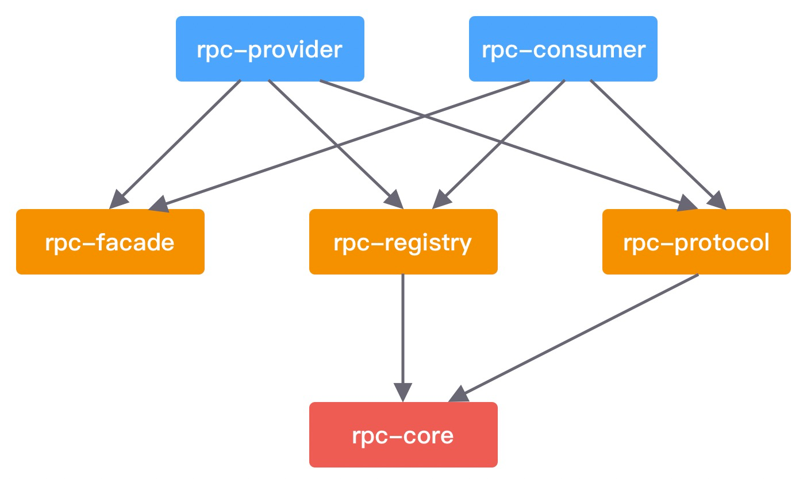

# Mini RPC

## 项目支持
 
本项目是拉勾教育专栏《Netty 核心原理剖析与 RPC 实践》源码，属于个人原创，仅供学习参考。

如果你对 Netty 的底层原理感兴趣，欢迎支持我的个人技术专栏，感谢。


## 项目架构


RPC 框架包含三个最重要的组件，分别是客户端、服务端和注册中心。在一次 RPC 调用流程中，这三个组件是这样交互的：

- 服务端在启动后，会将它提供的服务列表发布到注册中心，客户端向注册中心订阅服务地址；
- 客户端会通过本地代理模块 Proxy 调用服务端，Proxy 模块收到负责将方法、参数等数据转化成网络字节流；
- 客户端从服务列表中选取其中一个的服务地址，并将数据通过网络发送给服务端；
- 服务端接收到数据后进行解码，得到请求信息；
- 服务端根据解码后的请求信息调用对应的服务，然后将调用结果返回给客户端。

## 模块依赖



- rpc-provider，服务提供者。负责发布 RPC 服务，接收和处理 RPC 请求。
- rpc-consumer，服务消费者。使用动态代理发起 RPC 远程调用，帮助使用者来屏蔽底层网络通信的细节。
- rpc-registry，注册中心模块。提供服务注册、服务发现、负载均衡的基本功能。
- rpc-protocol，网络通信模块。包含 RPC 协议的编解码器、序列化和反序列化工具等。
- rpc-core，基础类库。提供通用的工具类以及模型定义，例如 RPC 请求和响应类、RPC 服务元数据类等。
- rpc-facade，RPC 服务接口。包含服务提供者需要对外暴露的接口，本模块主要用于模拟真实 RPC 调用的测试。

## 注册中心

```java
public interface RegistryService {

    void register(ServiceMeta serviceMeta) throws Exception;

    void unRegister(ServiceMeta serviceMeta) throws Exception;

    ServiceMeta discovery(String serviceName, int invokerHashCode) throws Exception;

    void destroy() throws IOException;
}
```

提供了 Zookeeper 的默认实现。

## 负载均衡

```java
public interface ServiceLoadBalancer<T> {
    T select(List<T> servers, int hashCode);
}
```

默认提供了一致性 Hash 算法实现服务发现功能。

## 通信协议

```
+---------------------------------------------------------------+
| 魔数 2byte | 协议版本号 1byte | 序列化算法 1byte | 报文类型 1byte  |
+---------------------------------------------------------------+
| 状态 1byte |        消息 ID 8byte     |      数据长度 4byte     |
+---------------------------------------------------------------+
|                   数据内容 （长度不定）                          |
+---------------------------------------------------------------+
```

## 环境搭建

- 操作系统：MacOS Big Sur，11.0.1
- 集成开发工具：IntelliJ IDEA
- 项目技术栈：SpringBoot 2.1.12.RELEASE + JDK 1.8.0_221 + Netty 4.1.42.Final
- 项目依赖管理工具：Maven 3.5.4
- 注册中心：Zookeeeper 3.4.14，需要特别注意 Zookeeeper 和 Apache Curator 一定要搭配使用，Zookeeper 3.4.x 版本，Apache Curator 只有 2.x.x 才能支持

## 项目测试

- 启动 Zookeeper 服务器：zkServer start
- 启动 rpc-provider 模块 RpcProviderApplication
- 启动 rpc-consumer 模块 RpcConsumerApplication
- 测试：浏览器输入 http://localhost:8080/hello，成功返回 hellomini rpc


